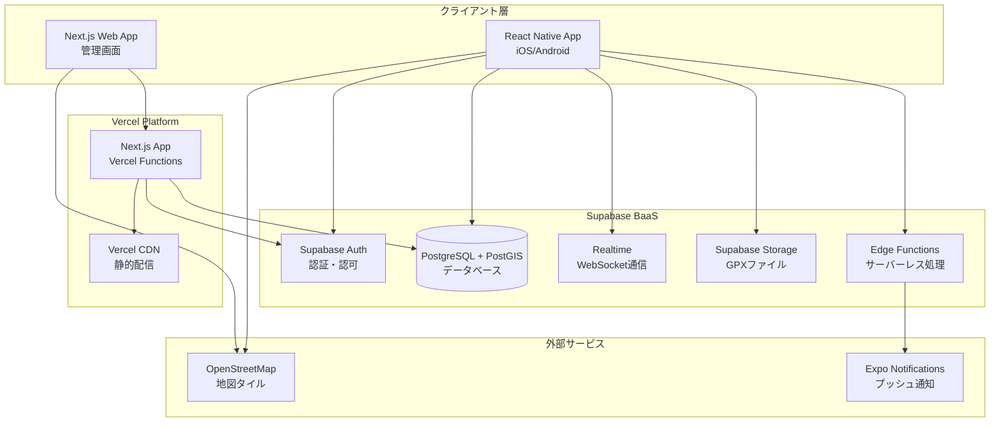

# デザイン文書

## 概要

CycleFog Connectは、モバイルアプリケーション（iOS/Android）として開発され、バックエンドAPIとリアルタイム通信機能を持つWebサービスと連携します。Fog of World型の地図可視化、グループライドマッチング、チャレンジ機能を統合したサイクリング支援プラットフォームです。

## アーキテクチャ

### システム全体構成



### 技術スタック

**フロントエンド（モバイル）:**
- React Native（iOS/Android対応）
- React Native Maps（地図表示）
- React Native Geolocation（GPS追跡）
- Zustand（軽量状態管理）
- React Navigation（画面遷移）

**バックエンド/インフラ:**
- Supabase（BaaS - Backend as a Service）
  - PostgreSQL + PostGIS（地理空間データ）
  - 認証・認可（Row Level Security）
  - リアルタイム機能（WebSocket）
  - ストレージ（GPXファイル）
  - Edge Functions（サーバーレス関数）

**フロントエンド（Web管理画面）:**
- Next.js 14（App Router）
- TypeScript（型安全性）
- Tailwind CSS（スタイリング）
- Vercel（ホスティング）

**外部サービス:**
- OpenStreetMap（地図タイル）
- Expo Notifications（プッシュ通知）

## コンポーネントとインターフェース

### 1. マップ可視化コンポーネント

#### FogMapRenderer
```typescript
interface FogMapRenderer {
  // 地図タイルの探索状態を管理
  renderExploredTiles(gpsTrack: GPSTrack[]): void;
  updateTileStatus(tileId: string, status: TileStatus): void;
  calculateExplorationPercentage(region: BoundingBox): number;
}

interface TileStatus {
  id: string;
  explored: boolean;
  explorationDate: Date;
  trackDensity: number; // 通過回数
}
```

#### GPSTrackProcessor
```typescript
interface GPSTrackProcessor {
  processGPXFile(file: GPXFile): GPSTrack[];
  validateTrackData(track: GPSTrack): ValidationResult;
  convertToTileCoordinates(gpsPoints: GPSPoint[]): TileCoordinate[];
}

interface GPSTrack {
  id: string;
  userId: string;
  points: GPSPoint[];
  startTime: Date;
  endTime: Date;
  distance: number;
  elevationGain: number;
}
```

### 2. グループライドマッチングコンポーネント

#### RideMatchingService
```typescript
interface RideMatchingService {
  createRideEvent(event: RideEventRequest): Promise<RideEvent>;
  searchRideEvents(criteria: SearchCriteria): Promise<RideEvent[]>;
  joinRideEvent(eventId: string, userId: string): Promise<JoinResult>;
  approveParticipant(eventId: string, participantId: string): Promise<void>;
}

interface RideEvent {
  id: string;
  organizerId: string;
  title: string;
  description: string;
  location: GeoLocation;
  startTime: Date;
  difficulty: DifficultyLevel;
  maxParticipants: number;
  participants: Participant[];
  status: EventStatus;
}
```

#### RealTimeLocationService
```typescript
interface RealTimeLocationService {
  // Supabase Realtimeを使用したリアルタイム位置共有
  startLocationSharing(rideId: string, userId: string): void;
  stopLocationSharing(rideId: string, userId: string): void;
  updateLocation(rideId: string, userId: string, location: GeoLocation): void;
  subscribeToRideLocations(rideId: string, callback: (locations: ParticipantLocation[]) => void): () => void;
}
```

### 3. チャレンジシステムコンポーネント

#### ChallengeManager
```typescript
interface ChallengeManager {
  createPersonalChallenge(challenge: PersonalChallengeRequest): Promise<Challenge>;
  createGroupChallenge(challenge: GroupChallengeRequest): Promise<Challenge>;
  updateProgress(challengeId: string, progress: ProgressUpdate): Promise<void>;
  checkCompletion(challengeId: string): Promise<CompletionResult>;
}

interface Challenge {
  id: string;
  type: ChallengeType; // EXPLORATION | DISTANCE | GROUP_EXPLORATION
  title: string;
  description: string;
  targetValue: number;
  currentValue: number;
  startDate: Date;
  endDate: Date;
  participants: string[];
  rewards: Reward[];
}
```

### 4. 通知システムコンポーネント

#### NotificationService
```typescript
interface NotificationService {
  sendProximityNotification(userId: string, unexploredArea: GeoArea): void;
  sendChallengeUpdate(challengeId: string, update: ChallengeUpdate): void;
  sendRideInvitation(eventId: string, recipientId: string): void;
  sendSafetyAlert(rideId: string, alert: SafetyAlert): void;
}

interface ProximityNotification {
  userId: string;
  message: string;
  unexploredArea: GeoArea;
  suggestedRoute: Route;
  triggerLocation: GeoLocation;
}
```

## データモデル

### ユーザーデータ

```sql
-- Supabase Authと連携するユーザープロフィール
CREATE TABLE profiles (
    id UUID REFERENCES auth.users(id) ON DELETE CASCADE PRIMARY KEY,
    email VARCHAR(255) NOT NULL,
    display_name VARCHAR(100) NOT NULL,
    cycling_level VARCHAR(20) CHECK (cycling_level IN ('leisure', 'racer')),
    region VARCHAR(10) CHECK (region IN ('DE', 'FR', 'NL')),
    preferred_language VARCHAR(5) DEFAULT 'en',
    avatar_url VARCHAR(500),
    bio TEXT,
    privacy_settings JSONB DEFAULT '{"location_sharing": false, "profile_public": true}',
    notification_settings JSONB DEFAULT '{"proximity_alerts": true, "challenge_updates": true}',
    created_at TIMESTAMP DEFAULT CURRENT_TIMESTAMP,
    updated_at TIMESTAMP DEFAULT CURRENT_TIMESTAMP
);

-- Row Level Security (RLS) ポリシー
ALTER TABLE profiles ENABLE ROW LEVEL SECURITY;

CREATE POLICY "Users can view own profile" ON profiles
    FOR SELECT USING (auth.uid() = id);

CREATE POLICY "Users can update own profile" ON profiles
    FOR UPDATE USING (auth.uid() = id);
```

### 地理空間データ

```sql
-- 地図タイル探索状況
CREATE TABLE explored_tiles (
    id UUID PRIMARY KEY DEFAULT gen_random_uuid(),
    user_id UUID REFERENCES users(id) ON DELETE CASCADE,
    tile_x INTEGER NOT NULL,
    tile_y INTEGER NOT NULL,
    zoom_level INTEGER NOT NULL DEFAULT 16,
    first_explored_at TIMESTAMP NOT NULL,
    last_visited_at TIMESTAMP NOT NULL,
    visit_count INTEGER DEFAULT 1,
    UNIQUE(user_id, tile_x, tile_y, zoom_level)
);

-- GPSトラックデータ
CREATE TABLE gps_tracks (
    id UUID PRIMARY KEY DEFAULT gen_random_uuid(),
    user_id UUID REFERENCES auth.users(id) ON DELETE CASCADE,
    name VARCHAR(200),
    start_time TIMESTAMP NOT NULL,
    end_time TIMESTAMP NOT NULL,
    total_distance DECIMAL(10,2), -- メートル
    elevation_gain DECIMAL(8,2), -- メートル
    track_data GEOMETRY(LINESTRING, 4326), -- PostGIS
    gpx_file_path VARCHAR(500), -- Supabase Storage path
    created_at TIMESTAMP DEFAULT CURRENT_TIMESTAMP
);

-- RLS ポリシー
ALTER TABLE gps_tracks ENABLE ROW LEVEL SECURITY;

CREATE POLICY "Users can manage own tracks" ON gps_tracks
    USING (auth.uid() = user_id);
```

### グループライドデータ

```sql
-- ライドイベント
CREATE TABLE ride_events (
    id UUID PRIMARY KEY DEFAULT gen_random_uuid(),
    organizer_id UUID REFERENCES auth.users(id) ON DELETE CASCADE,
    title VARCHAR(200) NOT NULL,
    description TEXT,
    start_location GEOMETRY(POINT, 4326),
    start_time TIMESTAMP NOT NULL,
    difficulty VARCHAR(20) CHECK (difficulty IN ('easy', 'moderate', 'hard')),
    max_participants INTEGER DEFAULT 10,
    status VARCHAR(20) DEFAULT 'open' CHECK (status IN ('open', 'full', 'started', 'completed', 'cancelled')),
    created_at TIMESTAMP DEFAULT CURRENT_TIMESTAMP
);

-- 参加者管理
CREATE TABLE ride_participants (
    ride_id UUID REFERENCES ride_events(id) ON DELETE CASCADE,
    user_id UUID REFERENCES auth.users(id) ON DELETE CASCADE,
    status VARCHAR(20) DEFAULT 'pending' CHECK (status IN ('pending', 'approved', 'declined')),
    joined_at TIMESTAMP DEFAULT CURRENT_TIMESTAMP,
    PRIMARY KEY (ride_id, user_id)
);

-- リアルタイム位置共有（グループライド中）
CREATE TABLE ride_locations (
    ride_id UUID REFERENCES ride_events(id) ON DELETE CASCADE,
    user_id UUID REFERENCES auth.users(id) ON DELETE CASCADE,
    location GEOMETRY(POINT, 4326),
    updated_at TIMESTAMP DEFAULT CURRENT_TIMESTAMP,
    PRIMARY KEY (ride_id, user_id)
);

-- RLS ポリシー
ALTER TABLE ride_events ENABLE ROW LEVEL SECURITY;
ALTER TABLE ride_participants ENABLE ROW LEVEL SECURITY;
ALTER TABLE ride_locations ENABLE ROW LEVEL SECURITY;

CREATE POLICY "Anyone can view open ride events" ON ride_events
    FOR SELECT USING (status = 'open');

CREATE POLICY "Organizers can manage their events" ON ride_events
    USING (auth.uid() = organizer_id);

CREATE POLICY "Participants can view ride locations" ON ride_locations
    FOR SELECT USING (
        EXISTS (
            SELECT 1 FROM ride_participants 
            WHERE ride_id = ride_locations.ride_id 
            AND user_id = auth.uid() 
            AND status = 'approved'
        )
    );
```

## エラーハンドリング

### エラー分類と対応

1. **GPS関連エラー**
   - 位置情報取得失敗: フォールバック機能で最後の有効位置を使用
   - GPXファイル破損: 有効な部分のみを処理し、エラー箇所を報告
   - 精度不足: 精度閾値以下のデータを除外

2. **ネットワークエラー**
   - API通信失敗: 指数バックオフによるリトライ機構
   - リアルタイム通信断絶: 自動再接続とオフライン状態表示
   - 地図タイル読み込み失敗: キャッシュされたタイルで代替表示

3. **データ整合性エラー**
   - 重複データ検出: 既存データとのマージ処理
   - 不正な地理座標: バリデーション後に修正または除外
   - タイムスタンプ不整合: サーバー時刻での正規化

### エラー処理フロー

```typescript
class ErrorHandler {
  static handleGPSError(error: GPSError): GPSErrorResponse {
    switch (error.type) {
      case 'PERMISSION_DENIED':
        return { 
          message: '位置情報の許可が必要です',
          action: 'REQUEST_PERMISSION',
          fallback: 'MANUAL_LOCATION_INPUT'
        };
      case 'POSITION_UNAVAILABLE':
        return {
          message: 'GPS信号を受信できません',
          action: 'RETRY_WITH_NETWORK',
          fallback: 'LAST_KNOWN_LOCATION'
        };
      case 'TIMEOUT':
        return {
          message: '位置情報の取得がタイムアウトしました',
          action: 'RETRY_WITH_LONGER_TIMEOUT',
          fallback: 'APPROXIMATE_LOCATION'
        };
    }
  }
}
```

## テスト戦略

### 1. ユニットテスト
- **対象**: 各サービスクラス、ユーティリティ関数
- **フレームワーク**: Jest + React Native Testing Library
- **カバレッジ目標**: 80%以上

### 2. 統合テスト
- **対象**: API エンドポイント、データベース操作
- **フレームワーク**: Supertest + Jest
- **テストデータ**: PostGISを使用した地理空間データのモック

### 3. E2Eテスト
- **対象**: 主要ユーザーフロー（ログイン、GPSトラック記録、グループライド参加）
- **フレームワーク**: Detox（React Native）
- **実行環境**: iOS/Androidシミュレーター

### 4. パフォーマンステスト
- **地図レンダリング**: 大量タイルの描画性能
- **Supabase Realtime**: 同時接続数とレスポンス時間
- **PostGIS クエリ**: 地理空間クエリの実行時間
- **Vercel Edge Functions**: レスポンス時間とコールドスタート

### テスト実装例

```typescript
// GPSトラック処理のユニットテスト
describe('GPSTrackProcessor', () => {
  test('should process valid GPX file correctly', () => {
    const processor = new GPSTrackProcessor();
    const mockGPXData = createMockGPXFile();
    
    const result = processor.processGPXFile(mockGPXData);
    
    expect(result).toHaveLength(1);
    expect(result[0].points).toHaveLength(100);
    expect(result[0].distance).toBeCloseTo(5000, 100); // 5km ±100m
  });

  test('should handle corrupted GPX data gracefully', () => {
    const processor = new GPSTrackProcessor();
    const corruptedGPX = createCorruptedGPXFile();
    
    const result = processor.processGPXFile(corruptedGPX);
    
    expect(result).toHaveLength(0);
    expect(processor.getLastError()).toContain('Invalid GPX format');
  });
});

// Supabaseクライアントを使用した統合テスト
describe('RideMatchingService', () => {
  test('should create and join ride event successfully', async () => {
    const supabase = createClient(supabaseUrl, supabaseAnonKey);
    
    // テストユーザーでログイン
    await supabase.auth.signInWithPassword({
      email: 'test@example.com',
      password: 'testpassword'
    });

    const rideData = {
      title: 'Morning Ride in Berlin',
      start_time: '2024-03-15T08:00:00Z',
      start_location: `POINT(13.4050 52.5200)`,
      difficulty: 'moderate'
    };

    const { data: ride, error } = await supabase
      .from('ride_events')
      .insert(rideData)
      .select()
      .single();

    expect(error).toBeNull();
    expect(ride.title).toBe('Morning Ride in Berlin');

    // 参加申請
    const { data: participation } = await supabase
      .from('ride_participants')
      .insert({ ride_id: ride.id })
      .select()
      .single();

    expect(participation.status).toBe('pending');
  });
});
```

このデザイン文書では、CycleFog Connectの技術アーキテクチャ、主要コンポーネント、データモデル、エラーハンドリング、テスト戦略を包括的に定義しました。Fog of World型の地図可視化とグループライド機能を中心とした、スケーラブルで保守性の高いシステム設計となっています。